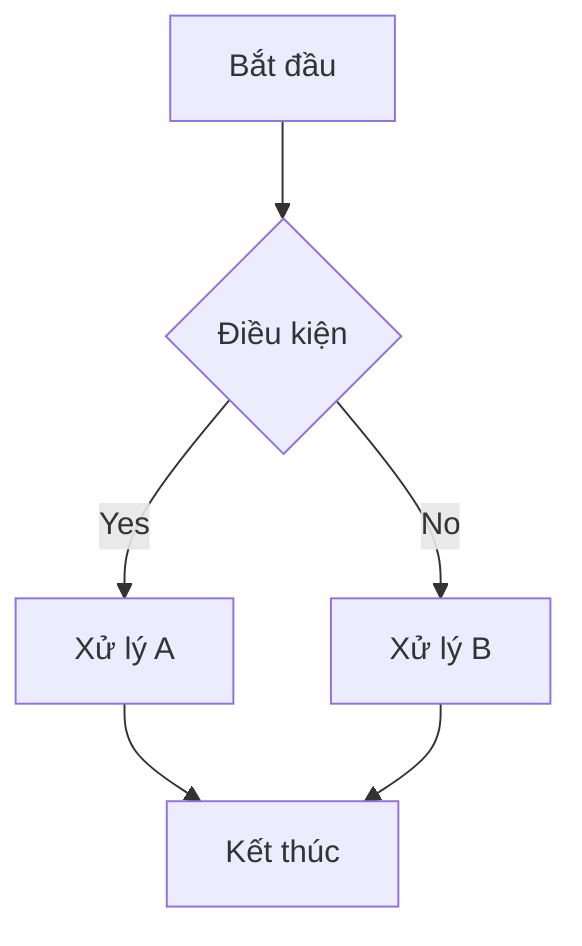

# TASK SPEC: [Tên Module/Task]

- **ID:** TS-[Dự án]-[Số hiệu]
- **Trạng thái:** [Draft/Approved/In Progress]
- **Chủ sở hữu:** Brain
- **Ưu tiên:** [P0/P1/P2]

---

## 1. 🏛️ BỐI CẢNH CHIẾN LƯỢC (Strategic Context)
*Lý giải tại sao task này quan trọng đối với roadmap dự án và giá trị kinh doanh cuối cùng.*

- **Vấn đề cần giải quyết:** [Pain point cụ thể]
- **Đối tượng hưởng lợi:** [ICP / Bộ phận]
- **Giá trị tài sản:** Task này có tạo ra asset tái sử dụng (Skill/Rule/Tool) không?

## 2. 🧩 TRỰC QUAN HÓA LOGIC (Logic Visualization)
*Yêu cầu sử dụng Mermaid diagram để mô tả quy trình.*



## 3. 🎨 GIAO DIỆN & TRẢI NGHIỆM (UI/UX - Dành cho FE)
- **Figma Prototype:** [Link tới Figma file/node]
- **Design Tokens:** [Dùng Tailwind config / CSS Variables hệ thống]
- **Breakpoints:** [Mobile / Tablet / Desktop]
- **Interaction Notes:** [Mô tả hiệu ứng hover, loading, animation]

## 4. 📊 HỢP ĐỒNG KỸ THUẬT & DỮ LIỆU (Technical Contract & Data Schema)
- **Swagger/OpenAPI:** [Link tới Swagger UI hoặc file yaml]
- **Data Schema:** 
```json
{
  "field_name": "type",
  "comment": "description"
}
```
- **Auth & Permissions:** [RBAC / Scopes / JWT roles]
- **Error Codes:** [Danh sách mã lỗi đặc thù]

## 5. ✅ CHECKLIST NGHIỆM THU (Definition of Done)

### [ ] Tiêu chuẩn Chung
- [ ] Hoàn thành 100% logic mô tả trong flowchart.
- [ ] Unit Test coverage > 80%.
- [ ] Hoàn thiện README và Video Demo.
- [ ] Link hardening proposal được ghi trong logs nếu có reusable logic.

### [ ] Tiêu chuẩn Frontend (Nếu có)
- [ ] Khớp 100% Pixel-perfect với Figma.
- [ ] Không sử dụng mã màu Hex thủ công (Chỉ dùng Design Tokens).
- [ ] Responsive hoạt động tốt trên các breakpoints quy định.

### [ ] Tiêu chuẩn Backend (Nếu có)
- [ ] API khớp 100% với Swagger Contract.
- [ ] Có Structured Logs (trace_id) cho mọi request.
- [ ] Xử lý lỗi theo đúng Error Code Table.

## 6. 🧾 TASK LIST TỔNG (Baseline Task List)

Task list này là baseline do Brain giao. Hands Agent dùng nó để lập Progress Snapshot trong `03_LOGS.md`, nhưng không tick/sửa trực tiếp ở đây để báo tiến độ.

- [ ] T1: [Mô tả task cụ thể]
- [ ] T2: [Mô tả task cụ thể]
- [ ] T3: [Mô tả task cụ thể]
- [ ] T4: [Mô tả task cụ thể]
- [ ] T5: [Mô tả task cụ thể]

Nếu task list cần đổi scope, Hands Agent phải ghi đề xuất vào `02_DECISION_LOGS.md`. Brain mới cập nhật `01_TASK_SPEC.md` khi chấp thuận.

---

## 🎁 PACKAGE BÀN GIAO (Handover Artefacts)
1. **Figma/Swagger Specs:** (Đã dẫn link ở trên)
2. **Seed Data / Mock Data:** [Link]
3. **Môi trường Sandbox (Docker):** [Link]
4. **Secrets/Env Example:** [Link]
5. **Observability Requirements:** (TraceID, Structured Logs)

---
**Brain Approval Signature:** ____________________ Date: __________
