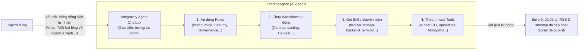

# LandingAgent — Hệ thống vận hành nội dung & tiếp thị tự động

## Tài liệu dành cho nhân viên truyền thông

---

## 1. LandingAgent là gì?

LandingAgent là **trợ lý AI chuyên trách toàn bộ hoạt động truyền thông số** của Letron — từ viết bài blog, đăng lên website, gửi RSS, cập nhật sitemap, đồng bộ mạng xã hội, cho đến thu thập khách hàng tiềm năng.

Điểm khác biệt cốt lõi: bạn **không cần biết code, không cần đăng nhập từng nền tảng social**. Bạn chỉ cần **trò chuyện với AI qua một hộp chat duy nhất** — mọi thao tác kỹ thuật phía sau do agent tự động xử lý.

> **Meta**: LandingAgent = Landing Page + AI Agent. Một agent chuyên trách toàn bộ "mặt tiền số" của Letron.

---

## 2. Nền tảng sử dụng: Antigravity Agent Chatbox

### 2.1 Bạn tương tác với hệ thống như thế nào?

Toàn bộ LandingAgent vận hành trên **Antigravity Agent Chatbox** — một giao diện chat nơi bạn trò chuyện trực tiếp với AI agent bằng tiếng Việt tự nhiên.

### 2.2 Tại sao dùng chat mà không cần giao diện quản trị?

| Giao diện truyền thống (CMS)       | Antigravity Agent Chatbox                     |
| :------------------------------------ | :-------------------------------------------- |
| Học cách dùng dashboard            | Gõ tiếng Việt tự nhiên                   |
| Tự tay upload ảnh, điền form, SEO | Agent làm hết                               |
| Đăng nhập từng nền tảng social  | Một câu lệnh → agent publish              |
| Không có AI hỗ trợ viết          | AI đồng hành từ idea → bài hoàn chỉnh |
| Mỗi người tự nhớ quy trình      | Rule & workflow đã cấu hình sẵn          |

---

## 3. Bên trong Agent: Rules, Skills, Workflows

Khi bạn chat với agent, đằng sau hộp thoại là một hệ thống các quy tắc và công cụ được cấu hình sẵn. Mỗi thành phần đảm nhận một vai trò riêng, phối hợp với nhau để agent luôn hành xử đúng — đúng giọng văn, đúng quy trình, đúng thương hiệu.

### 3.1 Rules — Quy tắc ứng xử của Agent

Rules là "luật chơi" agent phải tuân theo. Chúng đảm bảo agent luôn nhất quán với thương hiệu Letron và không làm sai quy trình kỹ thuật.

| Rule                            | Vai trò                                                                                                  |
| :------------------------------ | :-------------------------------------------------------------------------------------------------------- |
| **Brain Governance**      | Phân định rõ việc giữa agent "não" (chiến lược) và agent "tay" (thực thi), tránh chồng lấn |
| **Handover Protocol**     | Quy tắc bàn giao task giữa các agent với nhau, đảm bảo không mất ngữ cảnh                     |
| **Type Harden**           | Kiểm tra chặt chẽ kiểu dữ liệu đầu ra, tránh sai sót kỹ thuật ảnh hưởng nội dung          |
| **Contract Imports**      | Cách agent import và sử dụng các contract (giao ước) đã định nghĩa sẵn                       |
| **Conventional Commits**  | Quy chuẩn git commit để mọi thay đổi đều có log rõ ràng, truy vết được                     |
| **Gate Acceptance**       | Tiêu chí kiểm tra chất lượng trước khi cho phép publish nội dung                                |
| **Secret Management**     | Quy tắc bảo mật: agent không được lộ token, API key, mật khẩu dưới bất kỳ hình thức nào  |
| **Brand Voice & Context** | Giọng văn Letron, cấu trúc kể chuyện, taxonomy chuẩn — agent luôn viết đúng tone              |

### 3.2 Skills — Kỹ năng chuyên môn của Agent

Skills là các "kỹ năng" được nạp sẵn vào agent. Khi bạn yêu cầu một việc gì đó, agent tự động chọn skill phù hợp để thực thi.

**Nhóm Brain (Chiến lược):**

| Skill                   | Chức năng                                                                        |
| :---------------------- | :--------------------------------------------------------------------------------- |
| `9router`             | Cổng kết nối AI — agent gọi đúng model (GPT, Gemini, Claude) tùy theo task |
| `ls-api-viewer`       | Xem & kiểm tra API documentation trực tiếp, đảm bảo gọi đúng endpoint     |
| `ls-progress-manager` | Quản lý tiến độ dự án, snapshot hàng ngày, lọc task ưu tiên            |

**Nhóm Hands (Thực thi):**

| Skill                           | Chức năng                                                             |
| :------------------------------ | :---------------------------------------------------------------------- |
| `tailwind-design-system`      | Thiết kế giao diện landing/blog đúng chuẩn thiết kế của Letron |
| `nodejs-backend-patterns`     | Xử lý API, database, middleware — backend của landing page          |
| `prompt-engineering-patterns` | Tối ưu câu lệnh AI để viết nội dung chất lượng cao nhất     |
| `python-design-patterns`      | Xử lý script phân tích, báo cáo số liệu                         |
| `react-state-management`      | Quản lý trạng thái giao diện frontend landing page                 |

> **Cách nó hoạt động**: Khi bạn nói "Viết blog về logistics xanh", agent tự động kích hoạt `9router` để gọi model viết, `prompt-engineering-patterns` để tối ưu prompt, `ls-progress-manager` để ghi nhận task, và tự áp dụng rule về brand voice.

### 3.3 Workflows — Quy trình tự động hóa

Workflows là các "kịch bản" được lập trình sẵn. Khi agent nhận diện một tình huống quen thuộc, nó tự động chạy workflow tương ứng mà không cần bạn ra lệnh từng bước.

| Workflow                   | Khi nào kích hoạt         | Làm gì                                                                     |
| :------------------------- | :--------------------------- | :--------------------------------------------------------------------------- |
| **Contract Casting** | Khi cần tạo nội dung mới | Tự động load contract (giao ước) phù hợp với loại nội dung         |
| **Harvest Code**     | Sau khi hoàn thành task    | Tự động tổng kết, lưu bài học, cập nhật memory                     |
| **Init Satellite**   | Khi cần agent phụ          | Khởi tạo sub-agent chuyên biệt cho task nhỏ                             |
| **Session Snapshot** | Cuối mỗi phiên làm việc | Chụp lại toàn bộ trạng thái để lần sau tiếp tục đúng ngữ cảnh |
| **Push Rules**       | Khi quy tắc có thay đổi  | Đồng bộ rules mới xuống tất cả các agent                             |

### 3.4 Tools — Công cụ dòng lệnh

Đây là các công cụ kỹ thuật agent dùng để thao tác trực tiếp với hệ thống. Bạn không cần gõ lệnh — agent tự gọi.

| Tool                                 | Chức năng                                                                                                                                                                         |
| :----------------------------------- | :---------------------------------------------------------------------------------------------------------------------------------------------------------------------------------- |
| **`ls-post` CLI** (10 lệnh) | `save-idea`, `save-brief`, `save-asset`, `save-signal`, `publish-asset`, `search-content`, `get-content`, `fetch-metrics`, `schedule-asset`, `unschedule-asset` |
| **`upload.cjs`**             | Upload ảnh/tài liệu lên S3 cloud, trả về public URL                                                                                                                           |
| **MongoDB**                    | Lưu trữ toàn bộ nội dung, lead, metadata                                                                                                                                       |
| **QStash**                     | Lập lịch publish bài tự động theo thời gian định trước                                                                                                                   |

---

## 4. Các tính năng chính

### 4.1 Blog & Hệ thống nội dung

- **Tự động viết và đăng bài blog** — Agent AI hỗ trợ từ khâu brainstorm ý tưởng, viết brief, soạn nội dung đầy đủ, cho đến xuất bản.
- **Hỗ trợ 21 chủ đề (taxonomy)** — Phân loại bài viết theo: Thương hiệu (TH), Marketing (MM), Con người (CL), Pháp lý (PL). Agent tự gợi ý chủ đề phù hợp.
- **SEO tích hợp sẵn** — Mỗi bài blog khi publish tự động cập nhật RSS feed, sitemap, và robots.txt để Google index ngay.
- **Quản lý media qua S3** — Ảnh, video, tài liệu được upload thẳng lên cloud storage riêng, trả về public URL dùng ngay trong bài viết.

### 4.2 Thu thập khách hàng tiềm năng (Lead Capture)

- **Form đăng ký tích hợp trên landing page** — Khách điền tên + email, hệ thống tự động validate và lưu vào database.
- **Mỗi lead có ID riêng** — Dễ dàng theo dõi, phân loại, và chuyển cho đội kinh doanh.
- **Sắp có: email thông báo tự động** — Khi có lead mới, hệ thống gửi email cho người phụ trách (đang chờ kết nối Brevo API).

### 4.3 Tự động đăng bài lên mạng xã hội (đã có code, chờ kích hoạt)

- **7 nền tảng** — LinkedIn, Facebook, Instagram, Threads, TikTok, YouTube, Zalo.
- **Một câu lệnh → nhiều kênh** — Bạn chỉ cần nói "Publish bài này lên social", agent tự động đẩy lên tất cả các kênh đã cấu hình.
- **Cần token từ người dùng** — Mỗi nền tảng yêu cầu token xác thực (lấy từ mục cài đặt của từng nền tảng). Đây là bước làm một lần duy nhất.

### 4.4 Phân tích & theo dõi

- **Blog metrics** — Số lượt xem, tương tác (đang mock, chờ kết nối Google Analytics thật).
- **CTA tracking** — Theo dõi số lần người dùng nhấn nút kêu gọi hành động.
- **Google Search Console** — Theo dõi thứ hạng tìm kiếm (code đã có, chờ test với token thật).

### 4.5 Landing page hoàn chỉnh

- **40+ routes** — Trang chủ, blog, sản phẩm, tuyển dụng, RSS, sitemap, API.
- **Trang chủ** — Tự động hiển thị tin tức mới nhất từ blog.
- **Sản phẩm & Tuyển dụng** — Chi tiết từng mục, render từ file HTML tĩnh.

---

## 5. Hướng dẫn sử dụng hàng ngày

### 5.1 Bắt đầu một phiên làm việc

Bạn mở Antigravity Agent Chatbox và bắt đầu trò chuyện như với một đồng nghiệp:

> **Ví dụ câu lệnh thực tế:**
>
> - *"Hôm nay mình cần viết một bài blog về xu hướng logistics 2026. Có ý tưởng gì không?"*
> - *"Soạn giúp mình bài blog về chuyển đổi số trong vận tải, target giám đốc doanh nghiệp SME."*
> - *"Kiểm tra xem có lead mới từ hôm qua không."*
> - *"Đăng bài blog vừa viết lên website và Facebook nhé."*
> - *"Báo cáo số liệu blog tháng này cho mình."*

Agent sẽ tự động:

1. **Hiểu ngữ cảnh** (bạn là ai, đang làm gì, dự án nào)
2. **Chọn rule phù hợp** (giọng văn, taxonomy, quy trình)
3. **Gọi skill cần thiết** (viết nội dung, upload ảnh, publish)
4. **Chạy workflow** (idea → brief → asset → publish)
5. **Trả kết quả** kèm giải thích từng bước đã làm

### 5.2 Quy trình đăng một bài blog hoàn chỉnh

Chỉ cần trò chuyện với agent theo 5 bước tự nhiên:

| Bước         | Bạn nói gì                                                          | Agent làm gì                                                                |
| :------------- | :--------------------------------------------------------------------- | :---------------------------------------------------------------------------- |
| 1. Ý tưởng  | *"Mình muốn viết về logistics xanh, có ý tưởng gì không?"* | Brainstorm chủ đề, góc nhìn, đề xuất outline                          |
| 2. Chốt brief | *"OK chọn hướng này, taxonomy là Marketing."*                   | Xác định taxonomy, từ khóa, đối tượng                                |
| 3. Soạn bài  | *"Viết full bài luôn đi."*                                       | Soạn nội dung đầy đủ, chèn ảnh, metadata                              |
| 4. Upload ảnh | *"Lấy ảnh này làm cover nhé: [file ảnh]"*                      | Upload lên S3, nhúng public URL vào bài                                   |
| 5. Xuất bản  | *"Publish lên website đi."*                                        | Bài lên blog, RSS cập nhật, sitemap index, social đăng (nếu có token) |

> **Thời gian ước tính**: Với sự hỗ trợ của AI, một bài blog chất lượng hoàn thành trong **15-30 phút** (thay vì 2-3 giờ thủ công). Phần lớn thời gian là bạn kiểm duyệt và chỉnh sửa nội dung — agent lo phần còn lại.

### 5.3 Các tác vụ thường ngày khác

| Việc cần làm        | Bạn nói                                                       |
| :--------------------- | :-------------------------------------------------------------- |
| Kiểm tra lead mới    | *"Có lead nào mới từ hôm qua không?"*                   |
| Xem traffic blog       | *"Báo cáo lượt xem blog tuần này."*                     |
| Lên lịch đăng bài | *"Lên lịch publish bài này vào sáng thứ 2 tuần sau."* |
| Sửa bài đã đăng  | *"Sửa đoạn giới thiệu bài blog XYZ thành..."*          |
| Tìm bài cũ          | *"Tìm tất cả bài blog về chủ đề chuyển đổi số."*  |
| Đăng lại bài cũ   | *"Republish bài XYZ lên social."*                           |

---

## 6. Hiện trạng & Lộ trình

### Đã hoàn thành ✅

- Hệ thống blog (trang danh sách, chi tiết, RSS, sitemap)
- Form thu thập lead + lưu database MongoDB
- Công cụ `ls-post` CLI (10 lệnh)
- Cloud storage S3 cho toàn bộ media
- Phân loại nội dung 21 chủ đề (taxonomy registry)
- 8 Agent Rules cấu hình sẵn (brand voice, governance, security...)
- 5 Workflows tự động hóa (contract casting, harvest, snapshot...)
- 8 Skills chuyên môn (brain + hands)
- Code kết nối 8 nền tảng social (chờ token)

### Đang làm / Sắp làm 🔜

| Hạng mục                          | Mô tả                                                  |
| :---------------------------------- | :------------------------------------------------------- |
| Sản xuất blog content đầu tiên | Viết và publish bài blog thật đầu tiên            |
| Cải thiện giao diện blog         | Phân trang, tìm kiếm, lọc theo chủ đề             |
| Thông báo email khi có lead      | Gửi email tự động qua Brevo                          |
| Kích hoạt đăng social thật     | Người dùng cấp token → publish đồng loạt 8 kênh |
| Google Search Console               | Theo dõi thứ hạng tìm kiếm (code đã có)          |
| Google Analytics                    | Dashboard số liệu blog thật (đang mock)              |

## 7. Lợi ích cho nhân viên truyền thông

| Trước đây                                     | Với LandingAgent                                     |
| :------------------------------------------------ | :---------------------------------------------------- |
| Viết blog 2-3 giờ/bài                          | 15-30 phút/bài (AI soạn draft, bạn kiểm duyệt)  |
| Đăng từng nền tảng social thủ công         | Một câu nói → 8 kênh tự động                  |
| Theo dõi lead qua email rời rạc                | Tập trung trong database, sắp có thông báo       |
| Không biết bài đã được Google index chưa | Tự động sitemap + robots.txt + GSC                 |
| Ảnh lưu rải rác trên máy cá nhân          | Tập trung trên cloud, URL cố định                |
| Không đo được hiệu quả nội dung           | Analytics + CTA tracking + GSC sắp có               |
| Mỗi người viết một kiểu khác nhau          | Agent luôn viết đúng giọng văn Letron (rules)   |
| Quy trình không nhất quán                     | Workflows tự động hóa, ai dùng cũng giống nhau |

---

## 8. Hỏi đáp nhanh

**Q: Tôi có cần biết code để dùng không?**
A: Không. Bạn chỉ cần trò chuyện bằng tiếng Việt tự nhiên trong Antigravity Agent Chatbox. Agent tự chạy code, gọi API, upload file — bạn không thấy và không cần quan tâm phần kỹ thuật.

**Q: Antigravity Agent Chatbox ở đâu? Tôi mở nó như thế nào?**
A: Đây là ứng dụng chat chạy trên trình duyệt hoặc desktop. Bạn sẽ được cấp tài khoản và link truy cập. Giao diện giống như chat ChatGPT/Zalo — bạn gõ, agent trả lời và thực thi.

**Q: Làm sao để đăng bài lên Facebook/LinkedIn?**
A: Cần cấp token xác thực từ tài khoản mạng xã hội của Letron (làm một lần). Sau đó bạn chỉ cần nói "Đăng bài này lên social", agent tự động publish đồng loạt.

**Q: Nếu agent làm sai thì sao?**
A: Tất cả nội dung agent tạo ra đều ở trạng thái nháp. Bạn là người kiểm duyệt cuối cùng — có thể yêu cầu sửa, viết lại, hoặc hủy bất kỳ lúc nào trước khi publish. Sau khi publish, bài vẫn có thể sửa hoặc gỡ bình thường.

---

*Tài liệu này được tổng kết từ `docs/LandingAgent.md` — cập nhật tháng 7/2026.*
