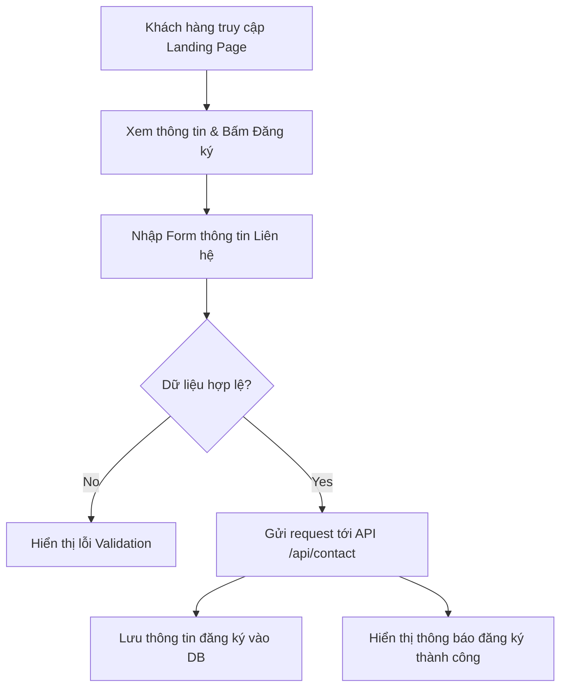

# TASK SPEC: LeOS Landing Page Initialization

- **ID:** TS-LEOS-LANDING-01
- **Trạng thái:** Approved
- **Chủ sở hữu:** Brain
- **Ưu tiên:** P1

---

## 1. 🏛️ BỐI CẢNH CHIẾN LƯỢC (Strategic Context)
*Lý giải tại sao landing-page quan trọng đối với roadmap dự án và giá trị kinh doanh cuối cùng.*

- **Vấn đề cần giải quyết:** Cung cấp cổng thông tin chính thức giới thiệu hệ sinh thái LeOS (Letron Operation System), hiển thị tính năng, và thu thập thông tin đăng ký dùng thử (Lead Generation) từ khách hàng.
- **Đối tượng hưởng lợi:** Khách hàng vãng lai, các doanh nghiệp logistics và đối tác vận tải (ICP).
- **Giá trị tài sản:** Bộ khung UI/UX tối ưu hóa SEO và chuyển đổi, các components giao diện mẫu có thể tái sử dụng.

## 2. 🧩 TRỰC QUAN HÓA LOGIC (Logic Visualization)
*Quy trình hoạt động của việc gửi form liên hệ trên Landing Page:*



## 3. 🎨 GIAO DIỆN & TRẢI NGHIỆM (UI/UX)
- **Figma Prototype:** (TBD - Theo tài liệu thiết kế thương hiệu LeOS)
- **Design Tokens:** Sử dụng Tailwind CSS v4 cấu hình sẵn trong dự án và các CSS Variables tại root.
- **Breakpoints:** Mobile (375px+), Tablet (768px+), Desktop (1024px+), Wide (1440px+).
- **Interaction Notes:**
  - Hiệu ứng Smooth Scroll cho menu điều hướng.
  - Hover micro-animations trên các nút (Buttons) và thẻ thông tin (Feature Cards).
  - Trạng thái loading khi submit form đăng ký.

## 4. 📊 HỢP ĐỒNG KỸ THUẬT & DỮ LIỆU (Technical Contract & Data Schema)
- **API Endpoint:** `POST /api/contact`
- **Data Schema (Contact Submission Request):**
```json
{
  "name": "string (required, min: 2)",
  "email": "string (required, format: email)",
  "company": "string (optional)",
  "phone": "string (optional, format: phone)",
  "message": "string (optional)"
}
```
- **Response Format:**
```json
{
  "success": "boolean",
  "message": "string",
  "lead_id": "string (uuid)"
}
```
- **Error Codes:**
  - `BAD_REQUEST_400`: Dữ liệu input không hợp lệ.
  - `SERVER_ERROR_500`: Lỗi xử lý từ hệ thống.

## 5. ✅ CHECKLIST NGHIỆM THU (Definition of Done)

### [ ] Tiêu chuẩn Chung
- [ ] Giao diện hoạt động mượt mà, cấu trúc HTML chuẩn ngữ nghĩa (Semantic HTML) và tối ưu SEO.
- [ ] Form đăng ký được validate cả ở Client-side và Server-side.
- [ ] Tích hợp đầy đủ công cụ vận hành Link Strategy và chạy `verify-gate` thành công.
- [ ] Không chứa hardcode thông tin nhạy cảm.

### [ ] Tiêu chuẩn Frontend
- [ ] Khớp thiết kế responsive, không bị vỡ layout trên các thiết bị mobile thông dụng.
- [ ] Đạt điểm số Core Web Vitals tối ưu (> 90 điểm Lighthouse hiệu năng & SEO).

## 6. 🧾 TASK LIST TỔNG (Baseline Task List)

Task list này là baseline do Brain giao. Hands Agent dùng nó để lập Progress Snapshot trong `03_LOGS.md`, nhưng không tick/sửa trực tiếp ở đây để báo tiến độ.

- [ ] T1: Khởi tạo khung dự án Next.js và tích hợp Link Strategy.
- [ ] T2: Phát triển giao diện phần Header, Hero Section và các Feature Sections.
- [ ] T3: Xây dựng Contact Form component và client-side validation logic.
- [ ] T4: Thiết lập API Endpoint `POST /api/contact` xử lý dữ liệu đăng ký.
- [ ] T5: Kiểm thử UI, khả năng responsive và kiểm thử API endpoint.

---

## 🎁 PACKAGE BÀN GIAO (Handover Artefacts)
1. **GitHub Repository:** Repo vệ tinh được kích hoạt và phân phối từ Brain.
2. **Mock Data:** Dữ liệu JSON mẫu phục vụ kiểm thử contact form.
3. **Secrets/Env Example:** `.env.example` chứa các cấu hình API endpoint.
4. **Lighthouse Report:** Báo cáo chỉ số tối ưu hóa trang web.

---
**Brain Approval Signature:** Antigravity AI  Date: 2026-07-03

